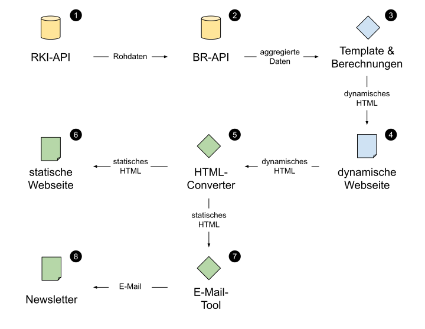

# Corona-Newsletter

Die wichtigsten Zahlen und Statistiken zur laufenden Corona-Pandemie als täglicher, automatisch generierter Newsletter. Alle Texte, Grafiken und Tabellen werden aus den jeweils aktuellsten Daten des [Robert Koch-Instituts](https://npgeo-corona-npgeo-de.hub.arcgis.com/datasets/dd4580c810204019a7b8eb3e0b329dd6_0/) erzeugt.

- **Webseite:** <https://ddj.br.de/corona-newsletter> (passwortgeschützt)
- **Newsletter:** <https://storage.googleapis.com/corona-newsletter/index.html>

## Verwendung

1. Repository klonen `git clone https://...`
2. Erforderliche Module installieren `npm install`
3. Entwicklungsserver starten `npm start`
4. Projekt bauen mit `npm run build`

Um die Module installieren und die Entwicklerwerkzeuge nutzen zu können, muss vorher die JavaScript-Runtime [Node.js](https://nodejs.org/en/download/) installiert werden. Informationen für Entwickler finden sich weiter [unten](#user-content-entwickeln).

## Architektur

Die Daten werden vom [RKI-API-Wrapper](https://github.com/br-data/corona-deutschland-api) bereitgestellt (gelb). Der [Newsletter](https://github.com/br-data/corona-newsletter-longread) wird in der [Google Cloud](https://github.com/br-data/cloud-deploy-template) gebaut (blau) und mit dem [Corona-Newsletter-Generator](https://github.com/br-data/corona-newsletter-generator) als statisches HTML gespeichert und versandt (grün).



## Spezielle Elemente

Die Webseite baut auf einer vereinfachten Version des [Webpack-Longread-Templates](https://github.com/br-data/webpack-longread-template) auf und erweitert dieses um einige projektspezifische Komponenten.

### Hilfsfunktionen

Die wichtigsten Funktionen, um zum Beispiel den Zwei-Wochen-Trend oder die Reproduktionszahl zu berechnen, befinden sich `src/scripts/utils.js`. Die Funktionen können an beliebiger stell importiert und verwendet werden.

Hier ein Beispiel zur Berechnung der Reproduktionszahl und des dazugehörigen Konfidenzintervals:

```javascript
import { reproNumber, confidence, sma } from '../utils';

const { caseData } = config;
const reproData = reproNumber(sma(caseData));
const reproValue = reproData[reproData.length - 2].value;
const confidenceInterval = confidence(reproData, '95');

console.log(reproValue, confidenceInterval);
```

### Text-Generator

Die Text-Generatoren in `src/scripts/text/` erzeugen Text für einen oder mehrere Bereiche der Webseite, welche über ihre jeweilige ID ausgewählt werden. Ein Textgerator bekommt einen oder mehrere Datensätze, aus denen der Text erzeugt wird.

Hier ein Beispiel für einen einfachen Text-Generator:

```javascript
export function init(config) {
  import { pretty, currentCount } from '../utils';
  const { target, caseData } = config;

  const text = `Zuletzt wurden ${pretty(currentCount(caseData))} Fälle in Deutschland gemeldet`;

  const textElement = document.querySelector(target);
  textElement.textContent = text;
}
```

Die Funktion würde in der `src/index.js` dann folgendermaßen importiert und verwendet werden:

```javascript
import * as textGenerator from './text/text-generator';

textGenerator.init({
  target: '#my-text-element',
  caseData: [{ value: 10 }, { value: 20 }, { value: 30 }]
});
```

### Tabellen-Generator

Die Tabellen-Generatoren in `src/scripts/table/` erzeugen HTML-Tabellen aus den übergeben Daten.

Im einfachsten Fall wir dafür einfach ein Objekt-Array mit der Funktion `json2table` in HTML umgewandelt. Natürlich können vorher noch verschiedene Aggregationen und Berechnungen durchgeführt werden.

```javascript
import { json2table } from '../utils';

export function init(config) {
  const { target, caseData } = config;

  const tableHtml = json2table(caseData);
  const parentElement = document.querySelector(target);
  parentElement.innerHTML = tableHtml;
}
```

Die Funktion würde in der `src/index.js` dann folgendermaßen importiert und verwendet werden:

```javascript
import * as tableGenerator from './table/table-generator';

tableGenerator.init({
  target: '#my-table-element',
  caseData: [{ name: 'A', value: 10 }, { name: 'B', value: 20 }, { name: 'C', value: 30 }],
});
```

Der Tabellen-Generator verwenden das responsive Design des Standardelements „Tabelle“ (siehe unten). Das Design der Kacheln kann in `src/styles/components/_table.scss` angepasst werden.

### Diagramme (Canvas)

Es stehen drei verschieden Diagrammtypen in `src/scripts/table/` zur Verfügung:

- Liniendiagramm: `line-chart.js`
- Säulendiagramm: `bar-chart.js`
- Flächendiagramm: `area-chart.js`
- Einfaches Balkendiagramm: `simple-chart.js`

Die Initialisierung funktioniert für alle Diagramme gleich:

```javascript
import AreaChart from './chart/area-chart';

const bayernAreaChart = new AreaChart({
  target: '#my-chart-element',
  caseData: caseData,
  recoveredData: recoveredData,
  deathData: deathData,
  meta: {
    title: 'Title des Diagramms',
    description: 'Beschreibung des Diagramms',
    author: 'Author',
    source: 'Quelle',
    date: 'Datenstand'
  }
});
```

Alle Diagramme verwenden [D3.js](https://d3js.org/), um ein [Canvas](https://developer.mozilla.org/en-US/docs/Web/API/Canvas_API)-Element zu zeichnen. Das Canvas-Element wird, wenn es fertig gezeichnet wurde, mit `canvas.toDataURL()` in einen Base64-String (PNG) umgewandelt. Das ermöglicht später, die dynamisch erzeugten Grafiken in statisches HTML umzuwandeln.

### Indikatoren

Die Indikatoren-Kacheln in `src/scripts/indicator/` bieten einen einfachen, dashboardartigen Überblick der wichtigsten Zahlen. Dazu erzeugt werden vier responsive `<div class="box">` Elemente erzeugt.

Verwendung:

```javascript
import * as indicator from './indicator/indicator';

indicator.init({
  target: '#my-indicator-element',
  caseData: caseData,
  recoveredData: recoveredData,
  deathData: deathData
});
```

Das Design der Kacheln kann in `src/styles/components/_indicator.scss` angepasst werden.

## Standardelemente

### Bilder und Bildunterschriften

Bilder können ganz normal über das ``-Element eingebunden werden. Wichtig ist eine aussagekräftige `alt=""`-Beschreibung (SEO und Accessibility). Bildbeschreibungen können mit einem Paragraphen und der Klasse `<p class="caption">Beschreibung</p>` hinzugefügt werden. Die relative Bildbreite ist abhängig vom Eltern-Container (siehe Raster):

```html
<main>
  <!-- seitenbreites Bild -->
  

  <section>
    <!-- inhaltsbreites Bild -->
    

    <div class="block">
      <!-- textbreites Bild mit Bildunterschrift -->
      
      <p class="caption">Beschreibung</p>
    </div>
  </section>
</main>
```

Für die Kompression der Bilder empfiehlt sich das JPEG-Format (40 % bis 60 % Kompression) und folgende Bildgrößen:

- Bild seitenbreit (Aufmacher): 1600 Pixel Breite
- Bild inhaltsbreit: 1120 Pixel Breite
- Bild textbreit: 785 Pixel Breite
- Vorschaubild: 520 Pixel Breite

Für Grafiken und Diagramme empfiehlt es sich fast immer, durch die geringe Dateigröße und das scharfe Rendering, das Vektorformat **SVG** zu verwenden.

### Infokasten

Der Infokasten bietet sich für kleinere Einschübe und Erklärtexte („Woher stammen die Daten?”) an.

```html
<div class="infobox">
  <h3>Infokasten</h3>

  <p>Class aptent taciti sociosqu ad litora torquent per conubia nostra, per inceptos himenaeos. Curabitur sodales ligula in libero. Sed dignissim lacinia nunc. Curabitur tortor. Pellentesque nibh. Aenean quam. In scelerisque sem at dolor. Maecenas mattis. Sed convallis tristique sem. Proin ut ligula vel nunc egestas porttitor. Morbi lectus risus, iaculis vel, suscipit quis, luctus non, massa. Fusce ac turpis quis ligula lacinia aliquet. Mauris ipsum.</p>
</div>
```

### Tabellen

Eigentlich eine klassische HTML-Tabelle mit kleinen CSS-Tricks, um eine schicke mobile Darstellung zu erreichen. Das `data-label`-Attribut sorgt für die richtige Spalten- und Zeilenbeschriftung in der mobilen Ansicht. Ein Beispiel:

```html
<table>
  <thead>
    <tr>
      <th>Temperatur</th><th>A</th><th>B</th><th>C</th>
    </tr>
  </thead>
  <tbody>
    <tr>
      <td data-label="Temperatur">Sommer</td><td data-label="A">2,1</td><td data-label="B">3,5</td><td data-label="C">7,4</td>
    </tr>
    <tr>
      <td data-label="Temperatur">Winter</td><td data-label="A">-2,8</td><td data-label="B">-2,4</td><td data-label="C">0,2</td>
    </tr>
  </tbody>
</table>
```

Daraus wird in der Desktop-Ansicht folgende Tabelle:  

```text
+------------+------+------+-----+
| Temperatur |  A   |  B   |  C  |
+------------+------+------+-----+
| Zeile 1    | 2,1  | 3,5  | 7,4 |
| Zeile 2    | -2,8 | -2,4 | 0,2 |
+------------+------+------+-----+
```

In der mobilen Ansicht wird aus jeder Zeile eine eigene kleine Tabelle mit den jeweiligen Werten:

```text
+------------+--------+
| Temperatur | Sommer |
+------------+--------+
| A          | 2,1    |
| B          | 3,5    |
| C          | 7,4    |
+------------+--------+

+------------+--------+
| Temperatur | Winter |
+------------+--------+
| A          | -2,8   |
| B          | -2,4   |
| C          | 0,2    |
+------------+--------+
```

Dabei werden die Daten transponiert. Das heißt, die X- und Y-Achse werden vertauscht. Bei manchen Datensätzen kann das zu Problemen führen, da nicht jeder Datensatz beliebig transponiertbar ist. In diesem Fall kann man die mobile Tabellenansicht im CSS auskommentieren. Mit etwas Nachdenken bekommt man jedoch fast jeden Datensatz in eine transponierbare Form.

### Navigation und Sharing

Mitlaufende Navigationsleiste. Der Hintergrund der Leiste und der Seitentitel sind zuerst unsichtbar. Erst beim Scrollen werden beide Elemente sichtbar. Das Verhalten der Navigationsleiste kann über zwei Parameter gesteuert werden:

```javascript
navigation.init({
  selector: '.navigation',
  debouce: 100,
  minY: 70
});
```

### Weitere Artikel (related)

Teaserfläche für verwandte Artikel. Sollte man auf jeden Fall am Ende des Artikels einzubauen, um wenigstens ein paar Leser auf dem Angebot des BR zu halten.

```html
<div class="related">
  <h2 class="uppercase">Mehr zum Thema</h2>

  <a href="https://br.de">
    <div class="image">
      <figure class="lazyload-wrapper ratio-3-2">
        
        <noscript>
          
        </noscript>
      </figure>
    </div>
    <div class="description">
      <p class="timestamp">22.11.19, 17:37 Uhr</p>
      <h3>Lorem ipsum dolores sit amet</h3>
      <p class="content">Morbi in dui quis est pulvinar ullamcorper. Etiam sit amet orci eget eros faucibus tincidunt. Duis leo. Sed fringilla mauris sit amet nibh.</p>
    </div>
  </a>

  <a href="#">
    <!-- weiterer Teaser -->
  </a>

  <a href="#">
    <!-- weiterer Teaser -->
  </a>
</div>
```

## Layout

Das Design richtet sich nach dem [BR24-Styleguide](https://share.ard-zdf-box.de/s/4dFDxWfbJsDd2gT#pdfviewer) und der gelebte Design-Praxis auf [BR24.de](https://br.de/nachrichten/).

### Typografie

Als Schriftart wird [Open Sans](https://www.google.com/fonts/specimen/Open+Sans) verwendet. Die bevorzugten Schriftschnitte sind:

- **Überschrift H1**: Bolder 700
- **Überschrift H2, H3, H4**: Bold 600
- **Fließtext**: Normal 400
- **Fließtext italic**: Normal 400 italic
- **Fließtext bold**: Bold 600

Die Basis-Schriftgrößen für die einzelnen Gerätegrößen sind:

- **Mobil**: 14px
- **Desktop**: 15px
- **Future**: 16px

### Raster (grid)

Das Longread-Template nutzt ein Gestaltungsraster. Dabei gibt es drei verschiedene Hierarchie-Ebenen:

- **main**: Seitenbreite Inhalte, zum Beispiel das Aufmacherbild
- **section**: Inhaltsbreite Inhalte, zum Beispiel Diagramme oder Kapitelaufmacher
- **block**: Textbreite Inhalte
- **marginals**: Randnotizen, fließen rechts, 20% der Inhaltsbreite
- **floats** (`.left`, `.right`): Zum Beispiel Zitate, fließen links oder recht, 45% der Inhaltsbreite

Die folgende Darstellung der Elemente ist nicht proportional:

```text
+-------------------------------------------------+
| main                                            |
|                                                 |
|  +-------------------------------------------+  |
|  | section                                   |  |
|  |                                           |  |
|  |   +---------------------------------------+  |
|  |   | .block                   | .marginals |  |
|  |   |                          |            |  |
|  +---------------------+  +------------------+  |
|  | .left               |  | .right           |  |
|  |   |                 |  |     |            |  |
|  |   |                 |  |     |            |  |
```

### Farben

Alle Farben sind im Sass-Modul `_color.scss` definiert. Hier finden sich auch die Farben für die Share-Buttons. Im Zweifelsfall sollte man immer eine der bestehenden Farben verwenden statt eine neue Farbe anzulegen. Farbskalen, für Choropleth-Karten oder Diagramme, kann man sich aus einer Basisfarbe mithilfe von Sass berechnen lassen. Eine Anleitung dazu findet sich [hier](http://alistapart.com/article/mixing-color-for-the-web-with-Sass).

### Enwicklungsserver

Zum lokalen Entwickeln ist ein kleiner [HTTP-Server](https://github.com/webpack/webpack-dev-server) integriert. Diesen kann man mit dem Befehl `npm start` starten. Der Server läuft unter <http://localhost:8080>. Beim Starten des Entwicklungsservers sollte automatisch ein neues Browserfenster aufgehen. Bei Änderungen am Quellcode wird die Seite automatisch neu geladen (Live Reloading).

### Stylesheets

Die Stylesheets unter `src/styles/` sind in [Sass](http://sass-lang.com/) geschrieben und modular angelegt:

- **base**: allgemeine, seitenübergreifenden Styles (Typo, Farben, Grid ...)
- **components**: komponentenspezifische Styles (Navigation, Footer, Zitate ...)
- **custom**: projektspezifische Stylesheets (Charts, ...)

Das CSS wird bei jeder Änderungen den Sass-Dateien neu erzeugt, sofern man den Webpack-Watch-Task gestartet hat. `npm start`. Als Compiler kommt [Dart Sass](https://github.com/sass/dart-sass) zum Einsatz, welcher deutlich schneller ist als der alte Ruby-Sass-Compiler.

*Hinweis*: Vendor-Prefixes wie `-webkit` oder `-moz` können weggelassen werden, das diese im Build durch den [Autoprefixer](https://github.com/postcss/autoprefixer) hinzugefügt werden.

### Javascript (ES6)

Das Javascript ist ebenfalls modular aufgebaut. Es gibt einen zentralen Einstiegspunkt `src/scripts/index.js`, wo im Idealfall alle notwendigen Komponenten importiert und initialisiert werden. Auch globale Event-Listener auf das `window` oder `document`-Objekt sollten hier registriert werden.

Hier ein einfach Beispiel für das Anlegen einen neuen Moduls unter `src/scripts/custom/module.js`:

```javascript
// Export default functions
export function init() {
  sayHello();
}

function sayHello() {
  console.log('Hello world')
}
```

In der `index.js` muss das Modul dann zuerst importiert und anschließend initialisiert werden:

```javascript
import * as module from './custom/module';

module.init();
```

Die meisten Module sind in Vanilla-Javascript (ohne andere Bibliotheken) geschrieben. Sollte man eine externe Bibliothek benötigen, kann man diese mit NPM installieren:

```shell
npm install d3 --save
```

Ein ausführliches Beispiel für einen D3.js-Diagramm findet sich unter `src/scripts/custom/chart.js`. Hier wird auch von der Möglichkeit der selektiven Imports Gebrauch gemacht. Es werden nur die Komponenten einer Bibliothek importiert, welche man in der eigenen Anwendung auch verwendet:

```javascript
import { select } from 'd3-selection';
import { max } from 'd3-array';
import { scaleLinear, scaleBand } from 'd3-scale';
import { axisBottom, axisLeft } from 'd3-axis';
```

[Sitepoint](https://www.sitepoint.com/understanding-es6-modules/) bietet einen gute Einführung in das Thema ES6-Module.
